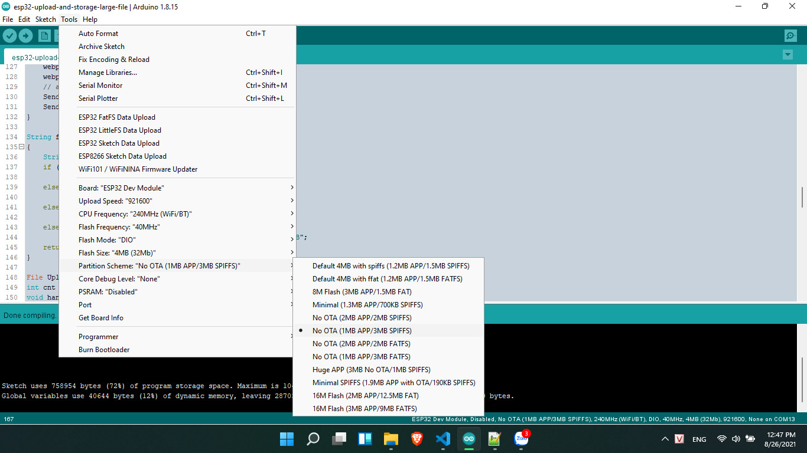
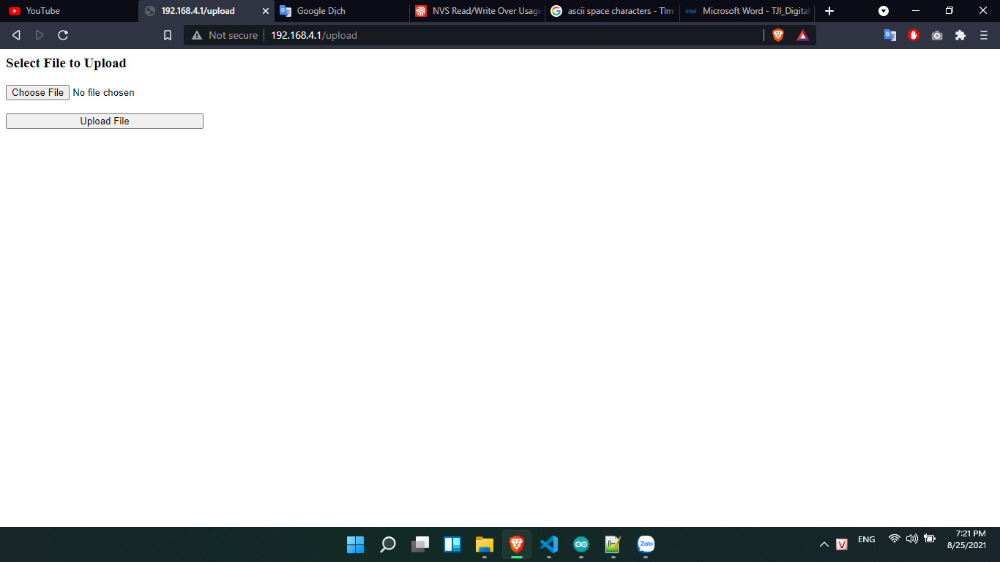

# esp32-upload-and-storage-large-file

This project allow user upload and storage large file in ESP32.
To save file to flash i using Little FS instead of SPIFFS because SPIFFS cannot use full memory in setting partition (https://github.com/lorol/LITTLEFS/issues/10).

## Installation

1. install esp32littlefs plugin(https://github.com/lorol/arduino-esp32littlefs-plugin)
2. add ESP32WebServer lib (https://github.com/Pedroalbuquerque/ESP32WebServer)

## Configure

1. Select board: `Tools` >> `ESP32 Dev Module`
2. upload file to flash: `Tools` >> `ESP32 LittleFS Data Upload`
3. Select Flash size: `Tools` >> `4MB`
4. Select Partition Scheme: `No OTA (1MB APP/3MB SPIFFS)`

5. Select COM Port: `Tools` >> `Port`
6. Compile and upload

## Usage
1. Connect to ESP32 Access Point: ssid `ESP32`, password `12345678`
2. Open Web Browser and type `192.168.4.1/upload`

3. Select text file wanna upload to ESP32

## References
- https://github.com/lorol/LITTLEFS
- https://github.com/G6EJD/ESP32-8266-File-Upload/blob/master/ESP_File_Download_Upload.ino
